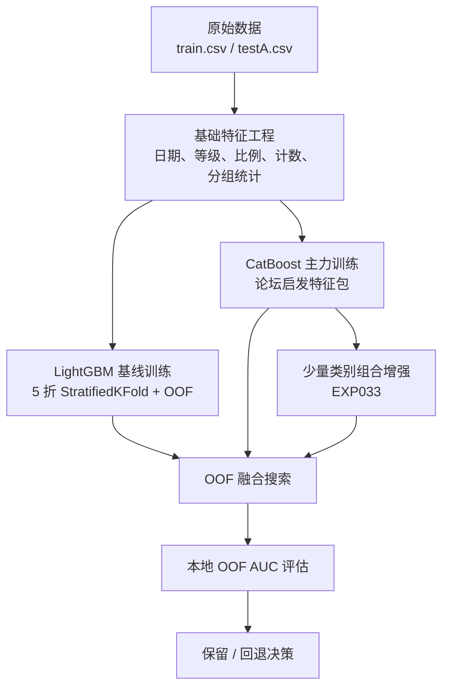

# 天池金融风控贷款违约预测解决方案

本仓库记录了一套围绕天池金融风控贷款违约预测赛题构建的完整解决方案。它不是单次训练脚本的备份，而是一条从基线搭建、特征工程、模型差异化到 OOF 融合提分的完整演进路径。

如果把这套方案压缩成一句话，可以概括为：

**以 LightGBM 建立稳定基线，以 CatBoost 承担主力建模，用无泄漏特征工程强化风险表达，再通过 OOF 驱动的线性融合提取最后一段增益。**

## 快速摘要

| 项目 | 内容 |
| --- | --- |
| 任务类型 | 金融风控表格二分类 |
| 评价指标 | `AUC` |
| 基础模型 | `LightGBM` |
| 主力模型 | `CatBoost` |
| 最关键特征 | 分箱特征、比例特征、时间窗口统计、分组相对位置特征 |
| 最有效策略 | `CatBoost` 主线 + 少量高质量类别组合 + OOF 线性融合 |
| 正式最优 AUC | `0.746763003490295` |
| 本地最高候选 AUC | `0.7470961136601179` |
| 当前仓库定位 | 可复现的比赛解决方案与完整复盘工程 |

## 一、项目定位

### 1. 比赛任务

根据借款人的贷款、信用、负债和历史行为特征，预测测试集样本的违约概率 `isDefault`。

### 2. 评价指标

比赛指标为 `AUC`。

这意味着模型优化的重点不是把概率校准到绝对准确，而是尽量提高风险排序能力，让高风险样本排在前面，低风险样本排在后面。

### 3. 仓库目标

这个仓库主要服务三个目标：

1. 保留一条可复现的比赛解决方案主线
2. 记录每一轮提分实验的判断依据与结果
3. 为后续复盘、迁移和二次优化提供结构化材料

## 二、方法流程图



## 三、结果概览

### 1. 本地 OOF 演进

| 阶段 | 本地 OOF AUC | 说明 |
| --- | ---: | --- |
| LightGBM 初始基线 | `0.737236` | 实验 001 |
| LightGBM + 目标编码 | `0.739345` | 实验 003 |
| LightGBM 同系融合 | `0.741039` | 实验 009 |
| LightGBM + CatBoost 融合 | `0.7436926207152882` | 实验 012 |
| 按保留规则更新的正式最优 | `0.746763003490295` | `EXP023` |
| 本地已验证最高候选 | `0.7470961136601179` | `EXP034 none` |

### 2. 当前需要区分的两个最佳

为了避免混淆，这里明确区分两个“最佳”概念：

#### 正式最优

这是按当前实验保留规则更新过的正式 best：

- AUC：`0.746763003490295`
- 文件：`outputs_blend_exp023/submission_blend_exp023_lgb_cat_forum.csv`
- 指标：`outputs_blend_exp023/metrics_blend_exp023_lgb_cat_forum.json`

#### 本地已验证最高候选

这是本地 OOF 更高、但未按当时规则升级为正式 best 的候选方案：

- AUC：`0.7470961136601179`
- 文件：`outputs_blend_exp034_none/submission_blend_exp034_pair_none.csv`
- 指标：`outputs_blend_exp034_none/metrics_blend_exp034_pair_none.json`

这两个结果共同构成了当前仓库最有参考价值的方案上界。

## 四、方案摘要

当前最有效的主线不是继续堆模型数量，而是把以下五件事做好：

1. 建立稳定的 LightGBM 基线
2. 用 CatBoost 接管高质量类别建模
3. 引入无泄漏的论坛启发特征工程
4. 只增加少量高价值类别交互
5. 用 OOF 线性融合而不是手工拍脑袋调权

最终形成的核心结构如下：

### 1. 正式最优方案

- 基础融合：`output/outputs_blend_exp012`
- 主力模型：`outputs_cat_exp023_forum`
- 融合权重：`0.09 / 0.91`
- 本地 OOF AUC：`0.746763003490295`

### 2. 本地最高候选方案

- 基础：`outputs_blend_exp023`
- 增强模型：`outputs_cat_exp033_combo`
- 最优双模型权重：约 `0.495 / 0.505`
- 本地 OOF AUC：`0.7470961136601179`

## 五、真正有效的提分机制

## 1. LightGBM 负责搭建稳定骨架

`baseline_lgb.py` 提供了整套方案的基础训练骨架，包含：

- 5 折 `StratifiedKFold` OOF 验证
- 日期特征
- 等级映射特征
- 比例特征
- 计数特征
- 分组统计特征
- 可选的 CV 安全目标编码

这条线的价值主要体现在两点：

1. 它建立了一个稳定、可解释、可重复的表格基线
2. 它为后续 CatBoost 融合提供了差异来源

## 2. CatBoost 承担主力建模任务

后期最明显的分数跃迁来自 `train_catboost.py` 这条线。

原因并不复杂：

- 对高基数类别特征的处理更自然
- 对类别与数值交互的建模更强
- 在当前风控表格场景中，类别信息的利用效率明显高于早期 LightGBM 基线

换句话说，后面的关键升级不是“换一个模型试试”，而是找到了更适合这类数据结构的主力模型。

## 3. 论坛启发特征包是决定性升级

`EXP023` 的真正价值，不是简单照搬论坛帖子，而是把其中有效、无泄漏、可本地验证的部分落到了代码里。

关键特征可以概括为四类：

### 分箱特征

- `employmentLength_bin`
- `issueDate_bin`
- `interestRate_bin`
- `annualIncome_bin`
- `loanAmnt_bin`
- `dti_bin`
- `installment_bin`
- `revolBal_bin`
- `revolUtil_bin`

作用：让树模型更容易学习风险区间，而不是强行从连续变量里硬拆阈值。

### 比例特征

- `installment_term_revolBal`
- `revolUtil_revolBal`
- `openAcc_totalAcc`
- `loanAmnt_dti_annualIncome`
- `annualIncome_loanAmnt`

作用：强化偿债压力、流动性紧张程度和借款规模合理性表达。

### 时间窗口统计

- `*_issueDate_median`
- `*_issueDate_ratio`

作用：把样本放回它所处的放款时间环境中去比较，表达同一时期下的相对异常程度。

### 同群体相对位置特征

按以下群体构造分组中位数比例：

- `employmentLength`
- `purpose`
- `homeOwnership`

作用：把个体样本和“同类人群”的正常水平做对照。

### 高 PSI 黑名单剔除

通过删除部分明显不稳定特征，降低分布漂移带来的伪增益风险。

## 4. 少量高质量类别组合带来最后一段增益

`EXP033` 只增加了 4 组类别组合：

- `grade__purpose`
- `subGrade__homeOwnership`
- `purpose__verificationStatus`
- `issueDate_bin__subGrade`

这一步的价值在于，它没有把特征空间做大规模爆炸，而是只补充了少量强交互：

- 单模型 AUC：`0.7467878225714177`
- 融合后 AUC：`0.7470960981385554`

这说明在当前任务里，少量高质量交互远比大规模组合更有效。

## 5. OOF 线性融合始终优于复杂变换

后期依次验证过：

- 双模型线性融合
- 更细粒度权重搜索
- 排序融合
- `logit` 融合
- 三模型融合

最终结论非常明确：

- 简单线性融合最好
- 复杂变换没有创造新的有效信息
- 新模型只有在确实提供差异时才值得进入融合池

## 六、收益较低或被证伪的方向

后期很多方向都跑通过，但收益有限，甚至明确失败：

- LightGBM 差异化补充模型：可运行，但与主力 CatBoost 的互补性不够强
- 论坛特征筛选：`EXP032` 虽过 smoke，但 full 明显变弱
- 对抗验证驱动的漂移剔除：AUC 接近 `0.5`，不是当前核心瓶颈
- 过度压缩类别组合：`EXP036` 反而掉分
- 轻量 combo-stat 增补：`EXP037` smoke 未过
- 排序融合与 `logit` 融合：均不如线性融合

这也是为什么当前代码最终停在“CatBoost 主线 + 少量类别组合增强”这个形态，而没有继续沿复杂融合或大规模特征裁剪方向推进。

## 七、关键经验总结

1. 先把 OOF 验证体系搭稳，再谈提分。
2. 在这个任务上，类别建模质量比盲目堆参数更重要。
3. 分箱和比例特征比很多表面复杂的统计特征更稳定。
4. 真正有价值的交互特征不需要很多，但必须有明确业务语义。
5. OOF 驱动的线性融合长期有效，复杂融合形式不一定更强。
6. 后期大多数失败实验都说明一件事：高分阶段更需要“少量高质量增量”，而不是继续扩张特征规模。

## 八、仓库结构

```text
.
├─ baseline_lgb.py                 # LightGBM 基线与变体
├─ train_catboost.py               # CatBoost 主力方案
├─ blend_predictions.py            # OOF / submission 融合脚本
├─ environment.yml                 # Conda 环境定义
├─ 实验记录.md                     # 完整实验记录
├─ 比赛总结与高分方案.md           # 详细复盘与方法总结
├─ PLAN.md                         # 目标模式实验规则
├─ output/                         # 历史输出目录
└─ outputs_*/                      # 各轮实验产物
```

说明：

- 原始数据文件不纳入版本管理
- 训练输出目录主要用于本地复盘与结果对照
- 官网提交留档目前保留在本地，不作为主仓库受控内容提交

## 九、环境准备

推荐使用 Conda / Miniforge：

```powershell
conda env create -f environment.yml
conda activate tianchi_finance
```

如果本机没有将 `conda` 加入 PATH，可以直接使用完整路径：

```powershell
C:\Users\makab\Miniforge3\Scripts\conda.exe env create -f environment.yml
C:\Users\makab\Miniforge3\Scripts\conda.exe run -n tianchi_finance python baseline_lgb.py
```

## 十、数据文件

本仓库不提交原始比赛数据，请自行放在项目根目录：

- `train.csv`
- `testA.csv`
- `sample_submit.csv`

## 十一、复现入口

## 1. 运行 LightGBM 基线

```powershell
C:\Users\makab\Miniforge3\Scripts\conda.exe run -n tianchi_finance python baseline_lgb.py
```

快速冒烟测试：

```powershell
C:\Users\makab\Miniforge3\Scripts\conda.exe run -n tianchi_finance python baseline_lgb.py --sample-rows 50000 --n-splits 3 --n-estimators 300 --early-stopping-rounds 30 --output-dir outputs_smoke
```

## 2. 运行 `EXP023` CatBoost 主力方案

```powershell
C:\Users\makab\Miniforge3\Scripts\conda.exe run -n tianchi_finance python train_catboost.py --train-path E:\tianchi_finance\train.csv --test-path E:\tianchi_finance\testA.csv --iterations 2500 --learning-rate 0.05 --depth 6 --l2-leaf-reg 5 --early-stopping-rounds 180 --output-dir E:\tianchi_finance\outputs_cat_exp023_forum --run-name cat_exp023_forum --numeric-category-cols --forum-features
```

## 3. 复现正式最优融合

```powershell
C:\Users\makab\Miniforge3\Scripts\conda.exe run -n tianchi_finance python blend_predictions.py --oof E:\tianchi_finance\output\outputs_blend_exp012\oof_blend_exp012_lgb_cat_grid001.csv E:\tianchi_finance\outputs_cat_exp023_forum\oof_cat_exp023_forum.csv --sub E:\tianchi_finance\output\outputs_blend_exp012\submission_blend_exp012_lgb_cat_grid001.csv E:\tianchi_finance\outputs_cat_exp023_forum\submission_cat_exp023_forum.csv --weights 0.09 0.91 --output-dir E:\tianchi_finance\outputs_blend_exp023_rebuild --run-name blend_exp023_rebuild
```

## 4. 复现本地最高候选双模型融合

先跑出 `EXP033`：

```powershell
C:\Users\makab\Miniforge3\Scripts\conda.exe run -n tianchi_finance python train_catboost.py --train-path E:\tianchi_finance\train.csv --test-path E:\tianchi_finance\testA.csv --iterations 2500 --learning-rate 0.05 --depth 6 --l2-leaf-reg 5 --early-stopping-rounds 180 --output-dir E:\tianchi_finance\outputs_cat_exp033_combo --run-name cat_exp033_combo --numeric-category-cols --forum-features --forum-category-combos v1
```

再做双模型融合：

```powershell
C:\Users\makab\Miniforge3\Scripts\conda.exe run -n tianchi_finance python blend_predictions.py --oof E:\tianchi_finance\outputs_blend_exp023\oof_blend_exp023_lgb_cat_forum.csv E:\tianchi_finance\outputs_cat_exp033_combo\oof_cat_exp033_combo.csv --sub E:\tianchi_finance\outputs_blend_exp023\submission_blend_exp023_lgb_cat_forum.csv E:\tianchi_finance\outputs_cat_exp033_combo\submission_cat_exp033_combo.csv --search-step 0.005 --output-dir E:\tianchi_finance\outputs_blend_exp034_none_rebuild --run-name blend_exp034_pair_none
```

## 十二、实验流程

后期实验遵循统一流程：

1. 先在 `实验记录.md` 中追加本轮实验计划
2. 先跑 smoke test
3. smoke 达标后才跑 full 5 折
4. full 完成后必须与当前 best 直接比较或做融合
5. 验证 submission 格式
6. 只用本地 OOF AUC 作为保留依据

这个流程的价值在于：

- 节省长时间 full 训练成本
- 降低无效试错
- 保证每一轮实验都有清晰的记录与回退依据

## 十三、建议阅读顺序

如果只想快速理解这套方案，建议按下面顺序阅读：

1. `比赛总结与高分方案.md`
2. `实验记录.md`
3. `train_catboost.py`
4. `baseline_lgb.py`
5. `blend_predictions.py`

## 十四、使用建议

如果后续准备基于这套代码继续训练，建议坚持以下原则：

- 保留 OOF 驱动的验证与融合方式
- 控制新增特征的质量，而不是一味增加数量
- 尽量避免引入目标泄漏风险
- 所有保留决策都由本地 OOF AUC 驱动

这套仓库更适合作为比赛复盘、方法借鉴和后续迁移的基础工程来使用。
